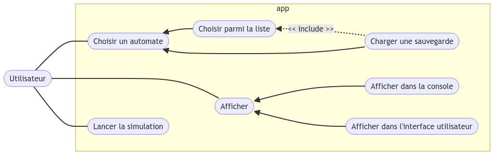
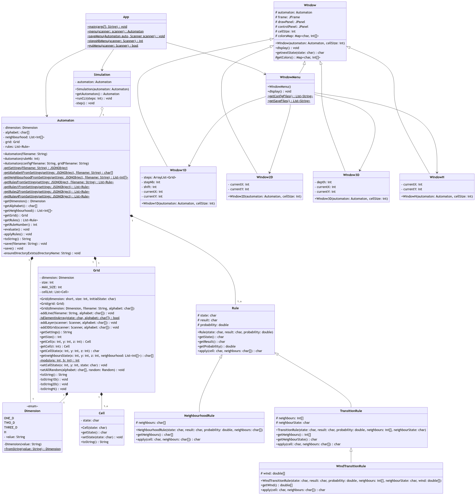
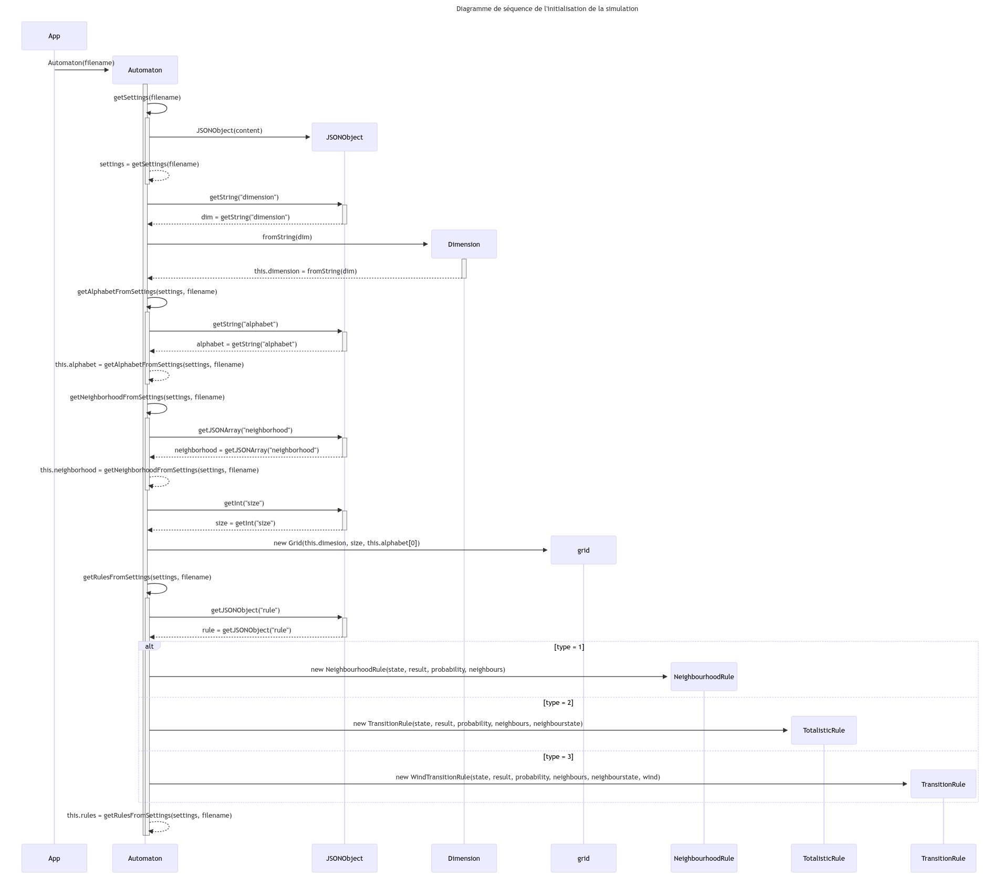
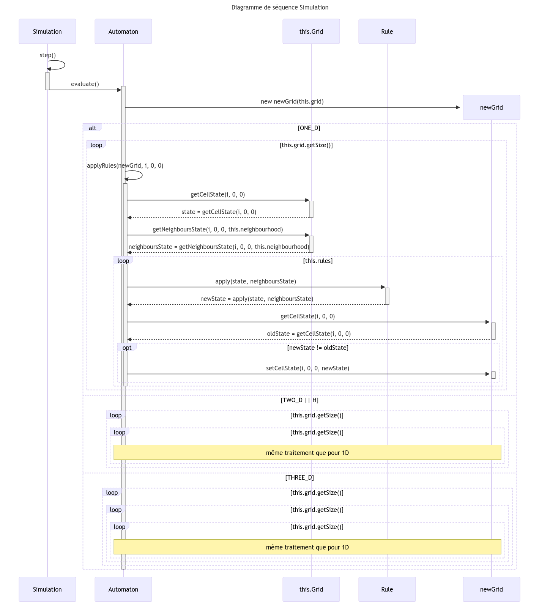

# Projet APO : automates cellulaires

[Lien du GitHub](https://github.com/rrrroo/APO_Automates)

## TODO

- [ ] Rapport
- [ ] Modélisation
    - [x] diagramme de cas d'utilisation
    - [ ] diagramme de classe
    - [ ] diagramme de séquence initialisation
    - [ ] diagramme de séquence évolution
- [x] Automates
    - [x] définition formelle
    - [x] 1D
        - [x] affichage 2D (espace * temps)
        - [x] affichage numéro de règle
    - [x] règle de la majorité
        - [x] 1D
        - [x] 2D
        - [x] 3D
        - [x] H
        - [x] voisinage carré
        - [x] voisinage rectangulaire
    - [x] jeu de la vie
    - [x] feu de forêt
        - [x] 2D classique
        - [x] 2D avec probabilité
        - [x] 2D avec vent
        - [x] H
        - [x] 4 voisins
        - [x] 8 voisins
- [ ] Tronc commun
    - [x] menu
        - [x] choisir un automate
        - [x] créer un automate
        - [x] charger une configuration de départ
    - [x] configuration de départ
        - [x] aléatoire
        - [x] dessin
        - [x] fichier
    - [x] grille
        - [x] 1D
        - [x] 2D
        - [x] 3D
        - [x] H
    - [ ] JavaDoc
- [ ] Extensions
    - [x] Git
    - [x] Ant
    - [ ] Tests unitaires
    - [x] fichiers de configuration
    - [x] sauvegarde
        - [x] utiliser les toString
        - [x] adapter le constructeur de Grid aux toString
    - [ ] interface graphique
        - [x] 1D
        - [x] 2D
        - [x] 3D
        - [ ] H
        - [x] menu
        - [x] dessin
        - [x] next step
        - [x] play/pause
    - [ ] statistiques

## Auteurs

- [Auriane Gonindard](https://github.com/AurianeG)
- [Romain Rochebloine](https://github.com/rrrroo)
- [Dorian Tonnis](https://github.com/Dorian-T)
- [Thomas Vittore](https://github.com/Sipior4)

## Description

L’objectif du projet est d’implémenter et d’étudier certains automates cellulaires. Nous avons fait le choix d'implémenter en premier un automate entièrement paramétrable, puis d'implémenter des automates spécifiques en utilisant cet automate paramétrable.
Tous les automates implémentés sont au format `.json`. Ainsi, il est facile de les modifier ou d'en créer de nouveaux.

## Méthodologie

Début décembre, nous avons commencé par une phase de conception en créant un premier jet des diagrammes de classe et de cas d’utilisation. Nous avons également commencé à créer et à documenter la syntaxe des fichiers JSON que nous utilisons pour stocker nos automates. 
Nous avons modifié certaines parties de notre conception originale au fil du projet quand nous nous rendions compte qu'elles pouvaient être améliorées.
Suite à cela, mi-décembre, nous avons créé toutes les classes et commencé à implémenter leurs méthodes.
Mi-janvier, l'affichage dans la console et les automates les plus simples (grille carrée, pas de vent…) fonctionnaient.
Nous avons ensuite continué en créant une interface graphique et en ajoutant des automates plus complexes (grille hexagonale, probabilité, vent…).

Toute la phase de conception a été faite en commun, puis nous avons séparé l'équipe en deux pour l'implémentation. Dorian et Auriane se sont occupés du noyau de l'application, tandis que Thomas et Romain se sont occupés de l'interface graphique et des intéractions avec l'utilisateur.

## Conception

Nous avons choisi de créer une implémentation d'automate la plus générale possible pour pouvoir créer n'importe quel automate à partir d'un simple fichier de configuration.
Pour des raisons de facilité d'affichage, nous avons choisi de limiter les automates à 3 dimensions.

### Diagramme de cas d'utilisation



### Diagramme de classes



### Diagramme de séquence initialisation



### Diagramme de séquence évolution



## Architecture

```
├── bin                     // fichiers .class
├── data
│   ├── configs             // fichiers de configuration des automates .json
│   └── saves               // fichiers de sauvegarde des grilles .txt
├── doc
│   ├── javadoc             // documentation Java
│   ├── uml                 // diagrammes UML
│   └── syntaxeAutomate.md  // guide de la syntaxe desfichiers de configuration
├── exe                     // exécutable .jar
├── lib                     // librairies
├── src
│   ├── main                // code source
│   └── test                // tests unitaires
├── build.xml               // fichier de configuration Ant
└── README.md
```

## Documentation

La documentation du projet est disponible dans le dossier `doc/` :
- `doc/javadoc/` : documentation Java au format .html
- `doc/uml/` : diagrammes UML au format .md et .png
- `doc/syntaxeAutomate.md` : guide de la syntaxe des fichiers de configuration des automates

> Pour visualiser les diagrammes UML, vous pouvez utiliser l'extension [Markdown Preview Mermaid Support](https://marketplace.visualstudio.com/items?itemName=bierner.markdown-mermaid) de Visual Studio Code.

## Librairies

Le projet utilise les librairies suivantes :
- [org.json](https://repo1.maven.org/maven2/org/json/json/20231013/json-20231013.jar) : pour la lecture et l'écriture de fichiers JSON

Les librairies sont à placer dans le dossier `lib/`.

## Compilation et exécution

Le projet peut être compilé à l'aide de ant. Pour cela il faut [télécharger ant](https://ant.apache.org/bindownload.cgi) et l'ajouter au PATH.

Les commandes suivantes sont disponibles :
- `ant clean` : vide les dossiers `bin/` et `exe/`
- `ant compile` : compile les fichiers .java dans `src/` et place les .class dans `bin/`
- `ant jar` : crée un .jar exécutable dans `exe/`
- `ant run` : exécute le .jar
- `ant javadoc` : crée la documentation Java dans `doc/javadoc/`

## Tests unitaires

Les tests unitaires sont disponibles dans le dossier `src/test/`. Ils peuvent être exécutés grace à JUnit.
