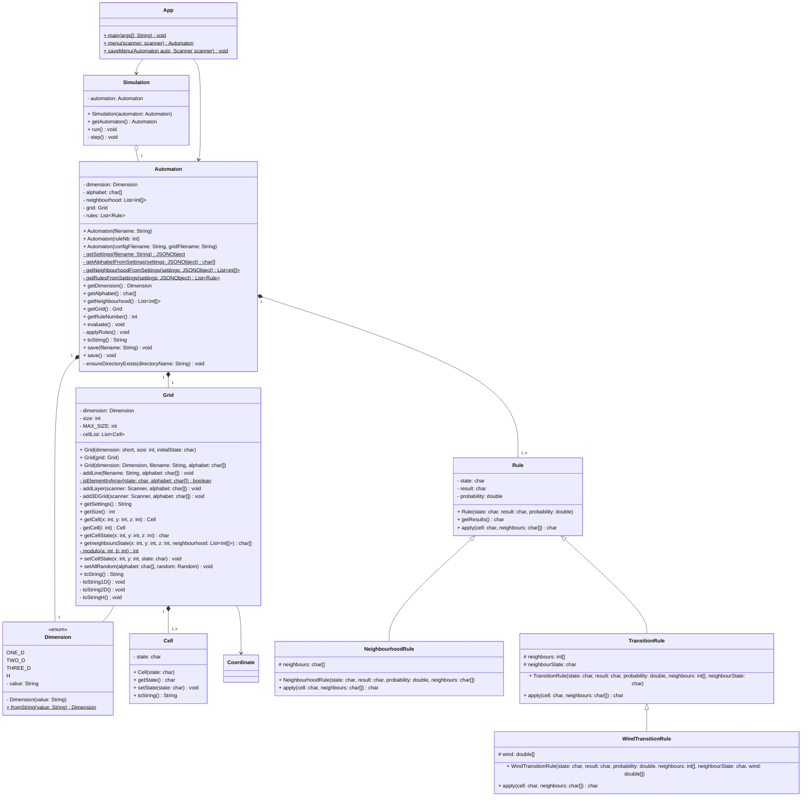

```mermaid
classDiagram
direction TB

    class App {
        + main(args[]: String) void$
        + menu(scanner: scanner) Automaton$
        + saveMenu(Automaton auto, Scanner scanner) void$
    }

    class Simulation {
        - automaton: Automaton

        + Simulation(automaton: Automaton)
        + getAutomaton() Automaton
        + run() void
        - step() void
    }

    class Automaton {
        - dimension: Dimension
        - alphabet: char[]
        - neighbourhood: List~int[]~
        - grid: Grid
        - rules: List~Rule~

        + Automaton(filename: String)
        + Automaton(ruleNb: int)
        + Automaton(configFilename: String, gridFilename: String)
        - getSettings(filename: String) JSONObject$
        - getAlphabetFromSettings(settings: JSONObject) char[]$
        - getNeighbourhoodFromSettings(settings: JSONObject) List~int[]~$
        - getRulesFromSettings(settings: JSONObject) List~Rule~$
        + getDimension() Dimension
        + getAlphabet() char[]
        + getNeighbourhood() List~int[]~
        + getGrid() Grid
        + getRuleNumber() int
        + evaluate() void
        - applyRules() void
        + toString() String
        + save(filename: String) void
        + save() void
        - ensureDirectoryExists(directoryName: String) void
    }

    class Dimension {
        <<enum>>

        ONE_D
        TWO_D
        THREE_D
        H

        - value: String

        - Dimension(value: String)
        + fromString(value: String) Dimension$
    }

    class Grid {
        - dimension: Dimension
        - size: int
        - MAX_SIZE: int
        - cellList: List~Cell~

        + Grid(dimension: short, size: int, initialState: char)
        + Grid(grid: Grid)
        + Grid(dimension: Dimension, filename: String, alphabet: char[])
        - addLine(filename: String, alphabet: char[]) void
        - isElementInArray(state: char, alphabet: char[]) boolean$
        - addLayer(scanner: Scanner, alphabet: char[]) void
        - add3DGrid(scanner: Scanner, alphabet: char[]) void
        + getSettings() String
        + getSize() int
        + getCell(x: int, y: int, z: int) Cell
        - getCell(i: int) Cell
        + getCellState(x: int, y: int, z: int) char
        + getneighboursState(x: int, y: int, z: int, neighbourhood: List~int[]~) char[]
        - modulo(a: int, b: int) int$
        + setCellState(x: int, y: int, state: char) void
        + setAllRandom(alphabet: char[], random: Random) void
        + toString() String
        - toString1D() void
        - toString2D() void
        - toStringH() void
    }

    class Cell {
        - state: char

        + Cell(state: char)
        + getState() char
        + setState(state: char) void
        + toString() String
    }

    class Rule {
        - state: char
        - result: char
        - probability: double

        + Rule(state: char, result: char, probability: double)
        + getResults() char
        + apply(cell: char, neighbours: char[]) char
    }

    class NeighbourhoodRule {
        # neighbours: char[]

        + NeighbourhoodRule(state: char, result: char, probability: double, neighbours: char[])
        + apply(cell: char, neighbours: char[]) char
    }

    class TransitionRule {
        # neighbours: int[]
        # neighbourState: char

        + TransitionRule(state: char, result: char, probability: double, neighbours: int[], neighbourState: char)
        + apply(cell: char, neighbours: char[]) char
    }

    class WindTransitionRule {
        # wind: double[]

        + WindTransitionRule(state: char, result: char, probability: double, neighbours: int[], neighbourState: char, wind: double[])
        + apply(cell: char, neighbours: char[]) char
    }


    %% Links :
    App                -->         Simulation
    App                -->         Automaton
    Simulation         o--  "1"    Automaton
    Automaton      "1" *--  "1"    Dimension
    Automaton      "1" *--  "1"    Grid
    Automaton      "1" *--  "1..n" Rule
    Grid               --          Dimension
    Grid           "1" *--  "1..n" Cell
    Grid               -->         Coordinate
    Rule               <|--        NeighbourhoodRule
    Rule               <|--        TransitionRule
    TransitionRule     <|--        WindTransitionRule
```