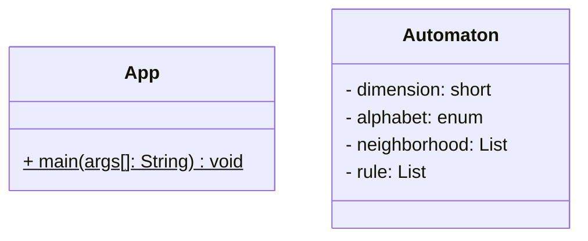

```mermaid
classDiagram
    class App {
        + main(args[]: String) void$
    }

    class Automaton {
        - dimension: short
        - alphabet: enum
        - neighborhood: List
        - rule: List
    }
```