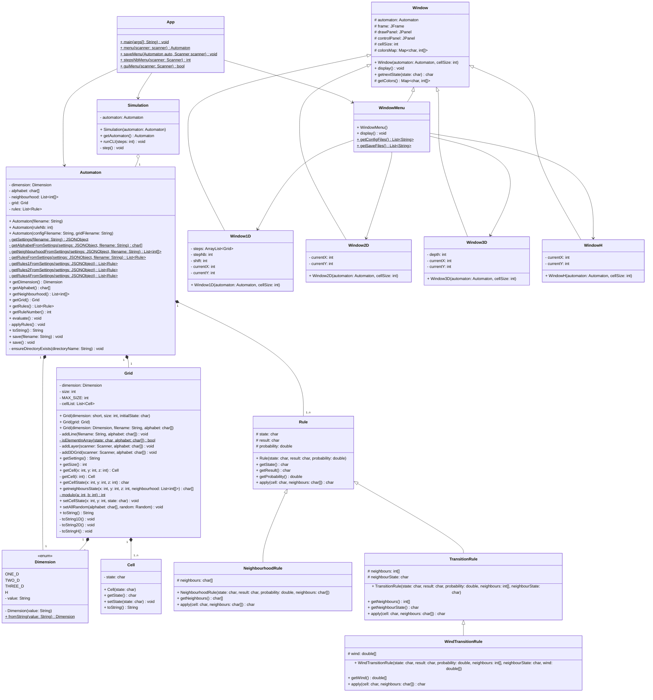

```mermaid
classDiagram
direction TB

    class App {
        + main(args[]: String) void$
        + menu(scanner: scanner) Automaton$
        + saveMenu(Automaton auto, Scanner scanner) void$
        + stepsNbMenu(scanner: Scanner) int$
        + guiMenu(scanner: Scanner) bool$
    }

    class Simulation {
        - automaton: Automaton

        + Simulation(automaton: Automaton)
        + getAutomaton() Automaton
        + runCLI(steps: int) void
        - step() void
    }

    class Automaton {
        - dimension: Dimension
        - alphabet: char[]
        - neighbourhood: List~int[]~
        - grid: Grid
        - rules: List~Rule~

        + Automaton(filename: String)
        + Automaton(ruleNb: int)
        + Automaton(configFilename: String, gridFilename: String)
        - getSettings(filename: String) JSONObject$
        - getAlphabetFromSettings(settings: JSONObject, filename: String) char[]$
        - getNeighbourhoodFromSettings(settings: JSONObject, filename: String) List~int[]~$
        - getRulesFromSettings(settings: JSONObject, filename: String) List~Rule~$
        - getRules1FromSettings(settings: JSONObject) List~Rule~$
        - getRules2FromSettings(settings: JSONObject) List~Rule~$
        - getRules4FromSettings(settings: JSONObject) List~Rule~$
        + getDimension() Dimension
        + getAlphabet() char[]
        + getNeighbourhood() List~int[]~
        + getGrid() Grid
        + getRules() List~Rule~
        + getRuleNumber() int
        + evaluate() void
        - applyRules() void
        + toString() String
        + save(filename: String) void
        + save() void
        - ensureDirectoryExists(directoryName: String) void
    }

    class Dimension {
        <<enum>>

        ONE_D
        TWO_D
        THREE_D
        H

        - value: String

        - Dimension(value: String)
        + fromString(value: String) Dimension$
    }

    class Grid {
        - dimension: Dimension
        - size: int
        - MAX_SIZE: int
        - cellList: List~Cell~

        + Grid(dimension: short, size: int, initialState: char)
        + Grid(grid: Grid)
        + Grid(dimension: Dimension, filename: String, alphabet: char[])
        - addLine(filename: String, alphabet: char[]) void
        - isElementInArray(state: char, alphabet: char[]) bool$
        - addLayer(scanner: Scanner, alphabet: char[]) void
        - add3DGrid(scanner: Scanner, alphabet: char[]) void
        + getSettings() String
        + getSize() int
        + getCell(x: int, y: int, z: int) Cell
        - getCell(i: int) Cell
        + getCellState(x: int, y: int, z: int) char
        + getneighboursState(x: int, y: int, z: int, neighbourhood: List~int[]~) char[]
        - modulo(a: int, b: int) int$
        + setCellState(x: int, y: int, state: char) void
        + setAllRandom(alphabet: char[], random: Random) void
        + toString() String
        - toString1D() void
        - toString2D() void
        - toStringH() void
    }

    class Cell {
        - state: char

        + Cell(state: char)
        + getState() char
        + setState(state: char) void
        + toString() String
    }

    class Rule {
        # state: char
        # result: char
        # probability: double

        + Rule(state: char, result: char, probability: double)
        + getState() char
        + getResult() char
        + getProbability() double
        + apply(cell: char, neighbours: char[]) char
    }

    class NeighbourhoodRule {
        # neighbours: char[]

        + NeighbourhoodRule(state: char, result: char, probability: double, neighbours: char[])
        + getNeighbours() char[]
        + apply(cell: char, neighbours: char[]) char
    }

    class TransitionRule {
        # neighbours: int[]
        # neighbourState: char

        + TransitionRule(state: char, result: char, probability: double, neighbours: int[], neighbourState: char)
        + getNeighbours() int[]
        + getNeighbourState() char
        + apply(cell: char, neighbours: char[]) char
    }

    class WindTransitionRule {
        # wind: double[]

        + WindTransitionRule(state: char, result: char, probability: double, neighbours: int[], neighbourState: char, wind: double[])
        + getWind() double[]
        + apply(cell: char, neighbours: char[]) char
    }

    class Window {
        # automaton: Automaton
        # frame: JFrame
        # drawPanel: JPanel
        # controlPanel: JPanel
        # cellSize: int
        # colorsMap: Map~char, int[]~

        + Window(automaton: Automaton, cellSize: int)
        + display() void
        + getnextState(state: char) char
        # getColors() Map~char, int[]~
    }

    class WindowMenu {
        + WindowMenu()
        + display() void
        + getConfigFiles() List~String~$
        + getSaveFiles() List~String~$
    }

    class Window1D {
        - steps: ArrayList~Grid~
        - stepNb: int
        - shift: int
        - currentX: int
        - currentY: int

        + Window1D(automaton: Automaton, cellSize: int)
    }

    class Window2D {
        - currentX: int
        - currentY: int

        + Window2D(automaton: Automaton, cellSize: int)
    }

    class Window3D {
        - depth: int
        - currentX: int
        - currentY: int

        + Window3D(automaton: Automaton, cellSize: int)
    }

    class WindowH {
        - currentX: int
        - currentY: int

        + WindowH(automaton: Automaton, cellSize: int)
    }


    %% Links :
    App                -->         Simulation
    App                -->         Automaton
    App                -->         WindowMenu
    Simulation         o--  "1"    Automaton
    Automaton      "1" *--  "1"    Dimension
    Automaton      "1" *--  "1"    Grid
    Automaton      "1" *--  "1..n" Rule
    Grid           "1" *--  "1"    Dimension
    Grid           "1" *--  "1..n" Cell
    Rule               <|--        NeighbourhoodRule
    Rule               <|--        TransitionRule
    TransitionRule     <|--        WindTransitionRule
    Window             <|--        WindowMenu
    Window             <|--        Window1D
    Window             <|--        Window2D
    Window             <|--        Window3D
    Window             <|--        WindowH
    WindowMenu         -->         Window1D
    WindowMenu         -->         Window2D
    WindowMenu         -->         Window3D
    WindowMenu         -->         WindowH
```