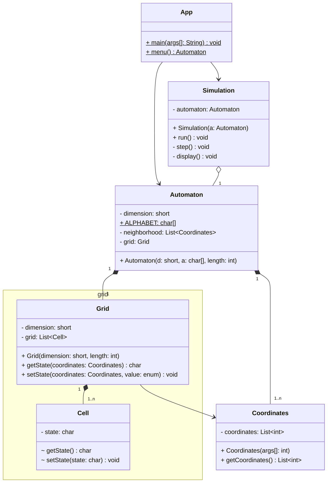
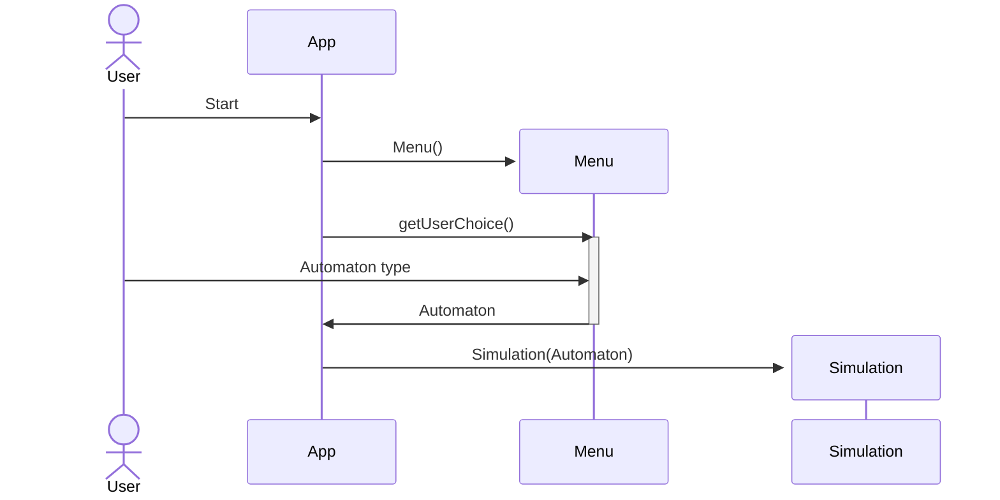

```mermaid
classDiagram
direction TB

    class App {
        + main(args[]: String) void$
        + menu() Automaton$
    }

    class Simulation {
        - automaton: Automaton

        + Simulation(a: Automaton)
        + run() void
        - step() void
        - display() void
    }

    class Automaton {
        - dimension: short
        + ALPHABET: char[]$
        - neighborhood: List~Coordinates~
        - grid: Grid

        + Automaton(d: short, a: char[], length: int)
        %% + rule(coordinates: Coordinates) char
    }

    namespace grid {
        class Grid {
            - dimension: short
            - grid: List~Cell~

            + Grid(dimension: short, length: int)
            + getState(coordinates: Coordinates) char
            + setState(coordinates: Coordinates, value: enum) void
        }

        class Cell {
            - state: char

            ~ getState() char
            ~ setState(state: char) void
        }
    }

    class Coordinates {
        - coordinates: List~int~

        + Coordinates(args[]: int)
        + getCoordinates() List~int~
    }


    %% Links :
    App              -->        Automaton
    App              -->        Simulation
    Simulation       o-- "1"    Automaton
    Automaton "1"    *-- "1..n" Coordinates
    Automaton "1"    *-- "1"    Grid
    Grid      "1"    *-- "1..n" Cell
    Grid             -->        Coordinates
```

```mermaid
sequenceDiagram
    actor User
    participant App

    User->> App: Start
    create participant Menu
    App ->> Menu: Menu()
    App ->> Menu: getUserChoice()
    activate Menu
    User ->> Menu: Automaton type
    Menu ->> App: Automaton
    deactivate Menu
    create participant Simulation
    App ->>+ Simulation: Simulation(Automaton)
    
```