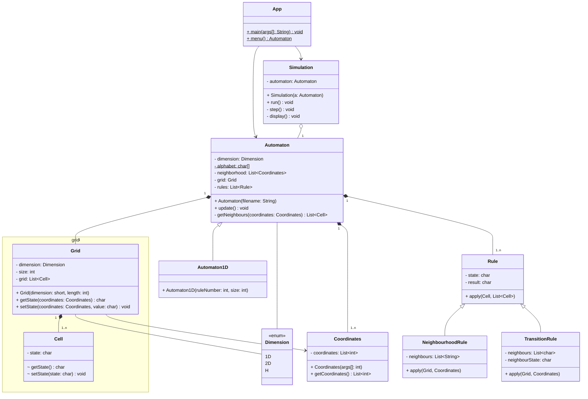

```mermaid
classDiagram
direction TB

    class App {
        + main(args[]: String) void$
        + menu() Automaton$
    }

    class Simulation {
        - automaton: Automaton

        + Simulation(a: Automaton)
        + run() void
        - step() void
        - display() void
    }

    class Automaton {
        - dimension: Dimension
        - alphabet: char[]$
        - neighborhood: List~Coordinates~
        - grid: Grid
        - rules: List~Rule~

        + Automaton(filename: String)
        + update() void
        - getNeighbours(coordinates: Coordinates) List~Cell~
    }

    class Automaton1D {
        + Automaton1D(ruleNumber: int, size: int)
    }

    class Dimension {
        <<enum>>

        1D
        2D
        H
    }

    namespace grid {
        class Grid {
            - dimension: Dimension
            - size: int
            - grid: List~Cell~

            + Grid(dimension: short, length: int)
            + getState(coordinates: Coordinates) char
            + setState(coordinates: Coordinates, value: char) void
        }

        class Cell {
            - state: char

            ~ getState() char
            ~ setState(state: char) void
        }
    }

    class Coordinates {
        - coordinates: List~int~

        + Coordinates(args[]: int)
        + getCoordinates() List~int~
    }

    class Rule {
        - state: char
        - result: char

        + apply(Cell, List~Cell~)
    }

    class NeighbourhoodRule {
        - neighbours: List~String~

        + apply(Grid, Coordinates)
    }

    class TransitionRule {
        - neighbours: List~char~
        - neighbourState: char

        + apply(Grid, Coordinates)
    }


    %% Links :
    App              -->        Automaton
    App              -->        Simulation
    Simulation       o-- "1"    Automaton
    Automaton        <|--       Automaton1D
    Automaton        --         Dimension
    Automaton "1"    *-- "1..n" Coordinates
    Automaton "1"    *-- "1"    Grid
    Automaton "1"    *-- "1..n" Rule
    Grid             --         Dimension
    Grid      "1"    *-- "1..n" Cell
    Grid             -->        Coordinates
    Rule            <|--       NeighbourhoodRule
    Rule            <|--       TransitionRule
```