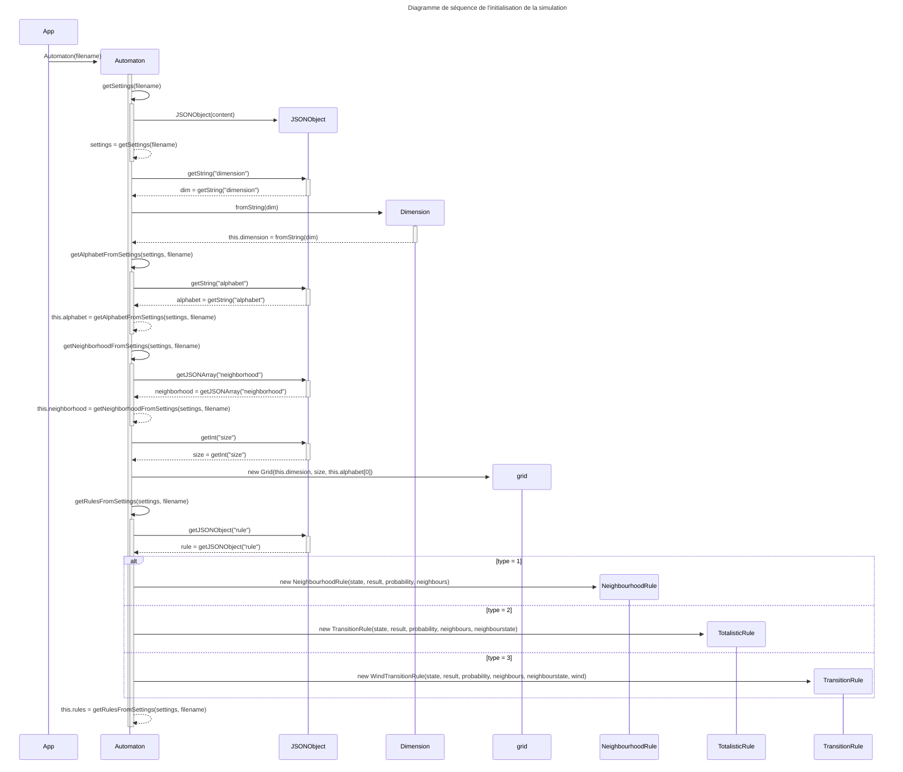

```mermaid
sequenceDiagram
    title Diagramme de séquence de l'initialisation de la simulation

    participant App

    create participant Automaton
    App ->>+ Automaton: Automaton(filename)

    Automaton ->>+ Automaton: getSettings(filename)
    create participant JSONObject
    Automaton ->> JSONObject: JSONObject(content)
    Automaton -->>- Automaton: settings = getSettings(filename)

    Automaton ->>+ JSONObject: getString("dimension")
    JSONObject -->>- Automaton: dim = getString("dimension")
    create participant Dimension
    Automaton ->>+ Dimension: fromString(dim)
    Dimension -->>- Automaton: this.dimension = fromString(dim)

    Automaton ->>+ Automaton: getAlphabetFromSettings(settings, filename)
    Automaton ->>+ JSONObject: getString("alphabet")
    JSONObject -->>- Automaton: alphabet = getString("alphabet")
    Automaton -->>- Automaton: this.alphabet = getAlphabetFromSettings(settings, filename)

    Automaton ->>+ Automaton: getNeighborhoodFromSettings(settings, filename)
    Automaton ->>+ JSONObject: getJSONArray("neighborhood")
    JSONObject -->>- Automaton: neighborhood = getJSONArray("neighborhood")
    Automaton -->>- Automaton: this.neighborhood = getNeighborhoodFromSettings(settings, filename)

    Automaton ->>+ JSONObject: getInt("size")
    JSONObject -->>- Automaton: size = getInt("size")
    create participant grid
    Automaton ->>+ grid: new Grid(this.dimesion, size, this.alphabet[0])

    Automaton ->>+ Automaton: getRulesFromSettings(settings, filename)
    Automaton ->>+ JSONObject: getJSONObject("rule")
    JSONObject -->>- Automaton: rule = getJSONObject("rule")
    alt type = 1
        create participant NeighbourhoodRule
        Automaton ->>+ NeighbourhoodRule: new NeighbourhoodRule(state, result, probability, neighbours)
    else type = 2
        create participant TotalisticRule
        Automaton ->>+ TotalisticRule: new TransitionRule(state, result, probability, neighbours, neighbourstate)
    else type = 3
        create participant TransitionRule
        Automaton ->>+ TransitionRule: new WindTransitionRule(state, result, probability, neighbours, neighbourstate, wind)
    end
    Automaton -->>- Automaton: this.rules = getRulesFromSettings(settings, filename)

    deactivate Automaton
```