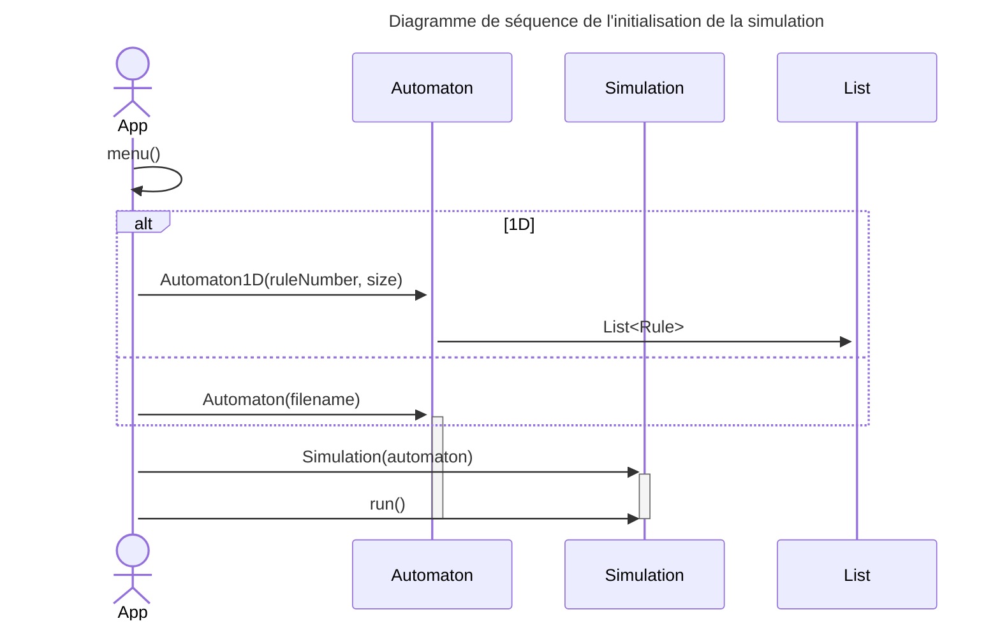

```mermaid
sequenceDiagram
    title Diagramme de séquence de l'initialisation de la simulation

    actor App
    participant Automaton
    participant Simulation

    App ->>+ App: menu()
    alt 1D
        App ->>+ Automaton: Automaton1D(ruleNumber, size)
        Automaton ->>+ List: List<Rule>
        %% TODO
    else
        App ->>+ Automaton: Automaton(filename)
        %% TODO
    end
    App ->>+ Simulation: Simulation(automaton)
    App ->> Simulation: run()
    deactivate Simulation
    deactivate Automaton
```