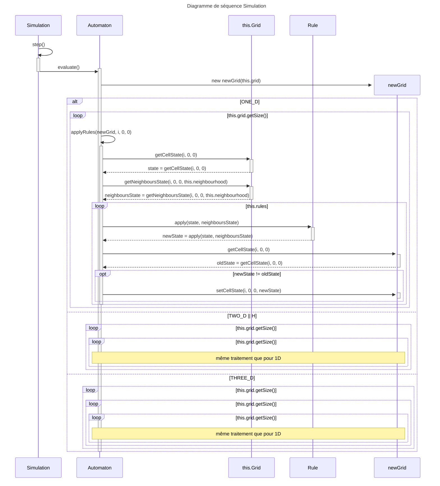

```mermaid
sequenceDiagram
    title Diagramme de séquence Simulation
    participant Simulation
    participant Automaton
    participant this.Grid
    participant Rule

    Simulation ->>+ Simulation: step()
    Simulation ->>+ Automaton: evaluate()
    deactivate Simulation
    create participant newGrid
    Automaton ->>+ newGrid: new newGrid(this.grid)

    alt ONE_D
        loop this.grid.getSize()
            Automaton ->>+ Automaton: applyRules(newGrid, i, 0, 0)
            Automaton ->>+ this.Grid: getCellState(i, 0, 0)
            this.Grid -->>- Automaton: state = getCellState(i, 0, 0)
            Automaton ->>+ this.Grid: getNeighboursState(i, 0, 0, this.neighbourhood)
            this.Grid -->>- Automaton: neighboursState = getNeighboursState(i, 0, 0, this.neighbourhood)
            loop this.rules
                Automaton ->>+ Rule: apply(state, neighboursState)
                Rule -->>- Automaton: newState = apply(state, neighboursState)
                Automaton ->>+ newGrid: getCellState(i, 0, 0)
                newGrid -->>- Automaton: oldState = getCellState(i, 0, 0)
                opt newState != oldState
                    Automaton ->>+ newGrid: setCellState(i, 0, 0, newState)
                    deactivate newGrid
                end
            end
            deactivate Automaton
        end
    else TWO_D || H
        loop this.grid.getSize()
            loop this.grid.getSize()
                Note over Automaton, newGrid: même traitement que pour 1D
            end
        end
    else THREE_D
        loop this.grid.getSize()
            loop this.grid.getSize()
                loop this.grid.getSize()
                    Note over Automaton, newGrid: même traitement que pour 1D
                end
            end
        end
    end

    deactivate Automaton
```