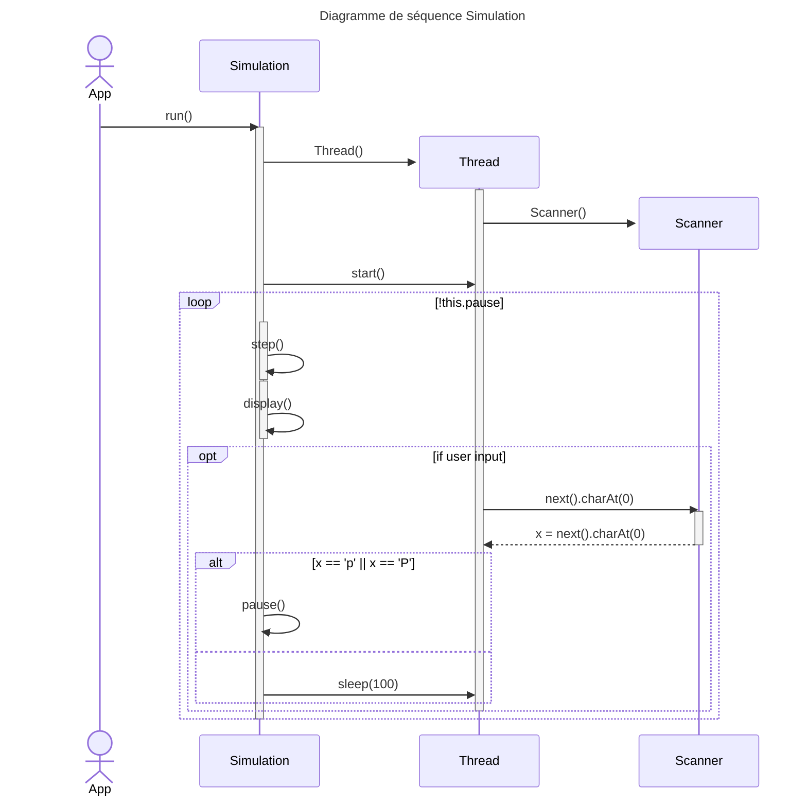

```mermaid
sequenceDiagram
    title Diagramme de séquence Simulation
    actor App
    participant Simulation

    App ->> Simulation: run()
    activate Simulation
    create participant Thread
    Simulation ->> Thread: Thread()
    activate Thread
    create participant Scanner
    Thread ->> Scanner: Scanner()
    Simulation ->> Thread: start()
    Loop !this.pause
        activate Simulation
        Simulation ->> Simulation: step()
        deactivate Simulation
        activate Simulation
        Simulation ->> Simulation: display()
        deactivate Simulation
        Opt if user input
            Thread ->> Scanner: next().charAt(0)
            activate Scanner
            Scanner -->> Thread: x = next().charAt(0)
            deactivate Scanner
            Alt x == 'p' || x == 'P'
                %% la variable volatile change de valeur
                Simulation ->> Simulation: pause()
            else
                Simulation ->> Thread: sleep(100)
            end
        end
        deactivate Thread
    end
    deactivate Simulation

```