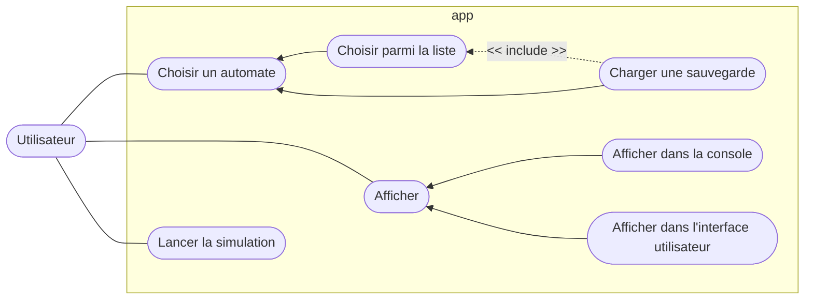

---

**Choisir un automate :** permet de choisir un automate.
- **Choisir parmi la liste :** permet de choisir un automate parmi ceux disponibles dans le dossier `data/configs`.
- **Charger une sauvegarde :** permet de choisir une grille sauvegardée, on choisit ensuite l'automate avec lequel on veut la simuler.

**Afficher :** permet de choisir comment afficher la simulation.
- **Afficher dans la console :** affiche la simulation dans la console.
- **Afficher dans l'interface utilisateur :** affiche la simulation dans une interface graphique.

**Lancer la simulation :** permet de lancer la simulation.

> A cause de notre choix de la librairie `Mermaid` pour générer les diagrammes UML, nous n'avons pas pu respecter le formalisme UML pour les diagrammes de cas d'utilisation.